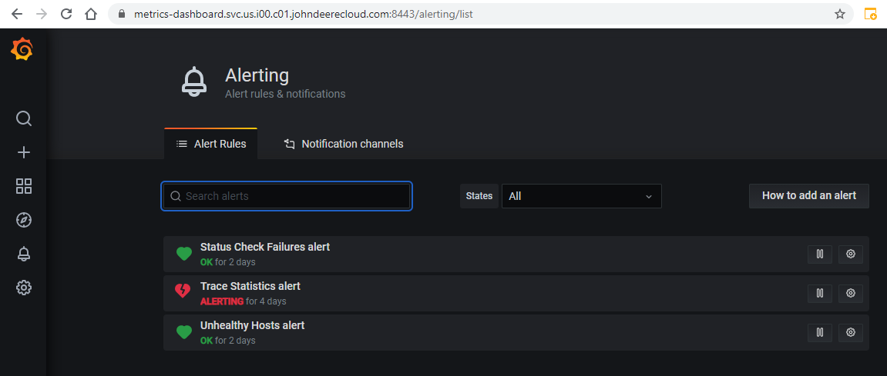
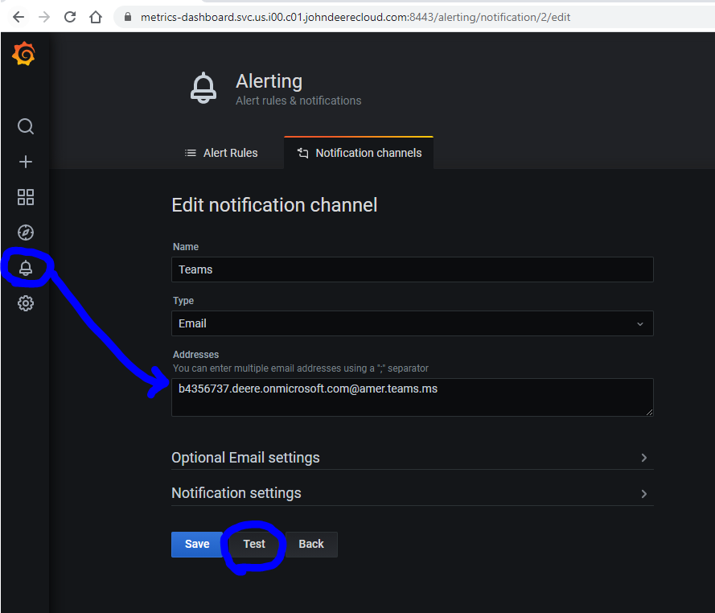

# Grafana Altering and Notifications
Within Grafana, you can set up alerting and notifications to send email to yourself, team PDL or to Microsoft Teams

# Configuration
To configure, you click on the alert bell icon, then go to "Notification channels" to create a "New channel":

You just add the email and then click an address or addresses to set up.  Click on "Test" to verify that the email is working:

!!! note
    If sending to Teams, you will need to set up a [smarthost](/Quickstart/Microsoft%20Teams/Integrations/email-to-channel/#send-email-from-aws) to send the email.