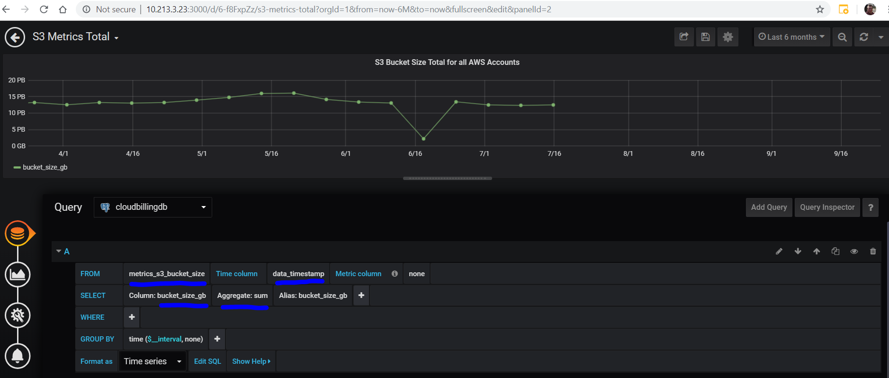
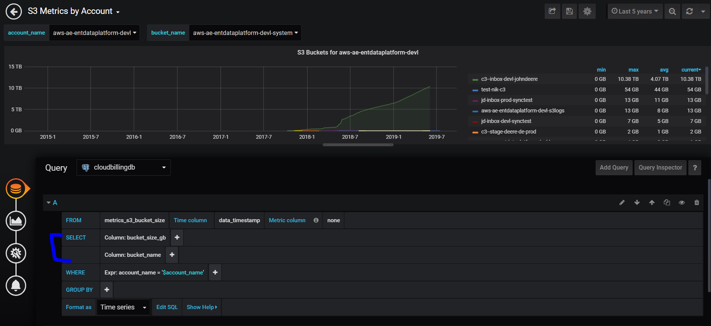
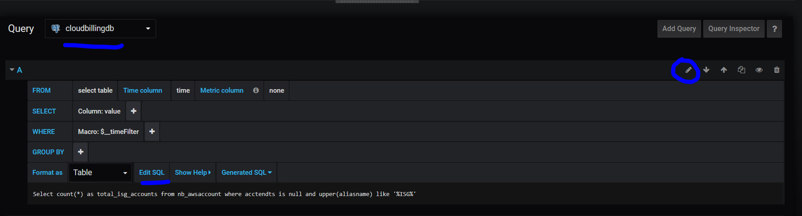
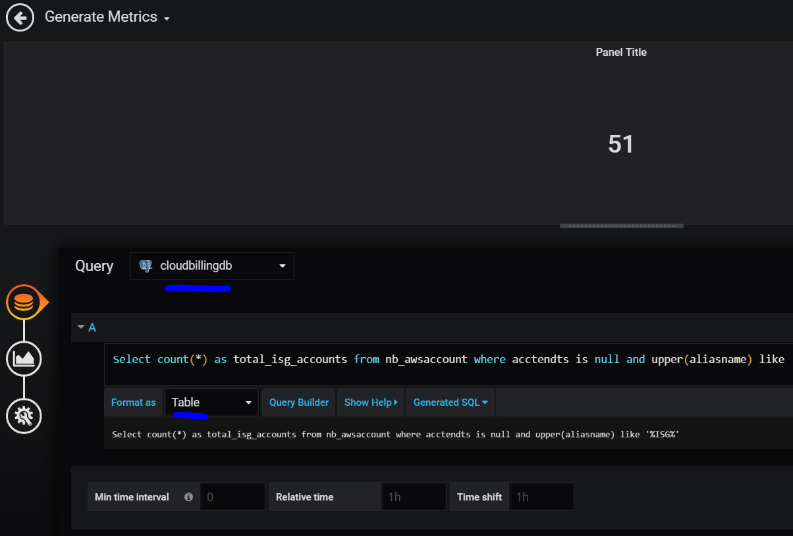
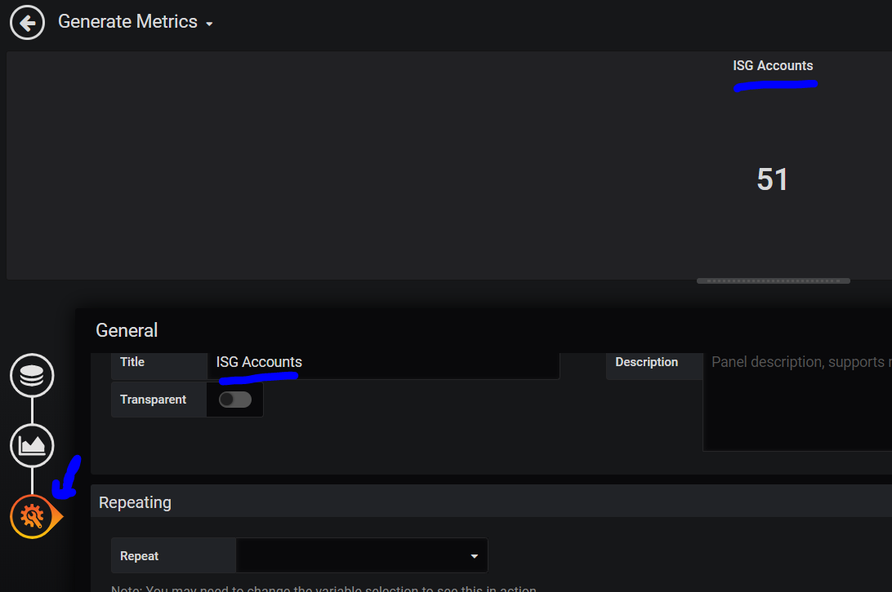
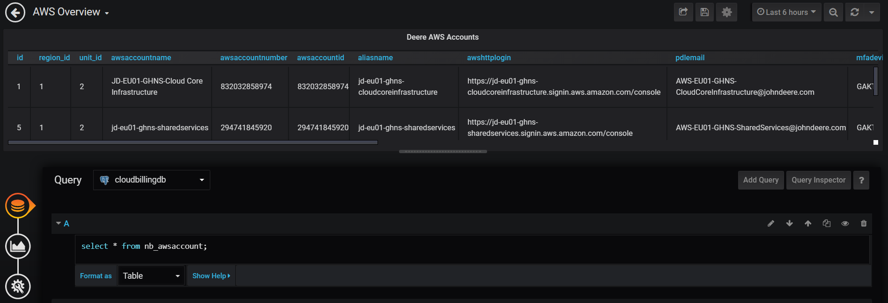
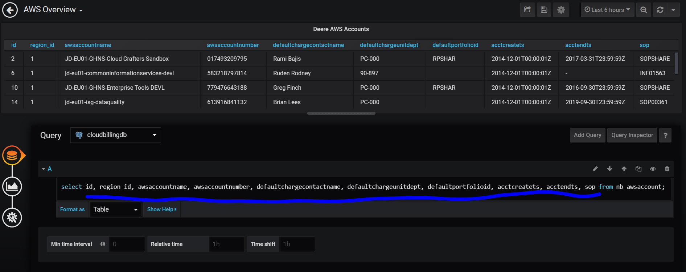
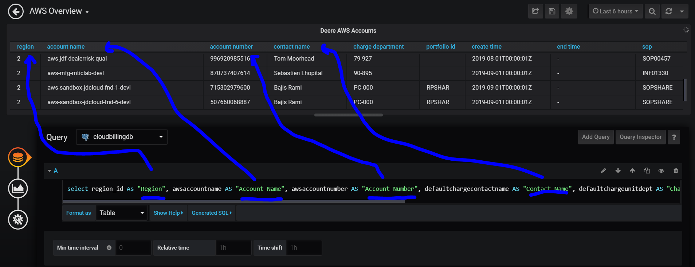
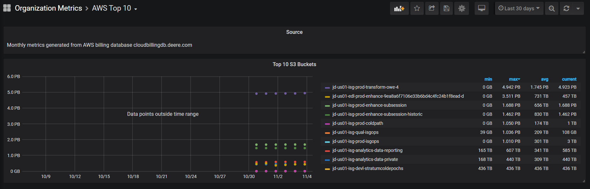

# Grafana Graphs

To create a Grafana Graph, you would need to create some kind of query that uses time series data

The data in a time series graph should include a column that has a timestamp.
If the data does not include a timestamp column, then it will be difficult to use a time series graph.  
You can use table format for these queries.
When creating a query, it would be similar to creating a SQL query or ES query. 
Grafana tries to make it easier to create the queries, but it may take some getting used to.


# Tips for Creating Queries

Start with a simple query.  As you modify the query, Grafana should try to redraw it in real time.
Save constantly.  Grafana makes it easy to revert dashboards if you need to.

## Creating a Query

To create a query:
* Select the data source and a table in the database.
    * Select a time column in the table. 
    * If this doesn't exist, it will be hard to draw data in a time series way without timestamps.
        * If the data does not have a time column, then you can use "Format as: Table", but don't expect to get changes over time.
    * Select a column or columns.
        * If you select multiple columns, then Grafana will try to graph both at the same time

# SQL Examples

S3 bucket size of all accounts using aggregate sum of all bucket sizes



S3 Metrics by account with drop downs for account name and/or bucket name



## Importing SQL Queries into Grafana

Sometimes, you may have SQL queries that you would like to import into Grafana.  These are also easy to do using the "Edit SQL" button which brings you into the query builder to paste in SQL queries:





## Select Certain Fields in SQL Queries

If you select *, then Grafana will generate a table with all fields, but you may not want to display all the fields:



You can limit that using SQL statements that limit the columns that you want:



## Rename Certain Fields in SQL Queries

You may not like the default names of the columns and want to change those:



## Top 10 Metrics

Top 10 metrics are SQL select queries within queries...

```
# Show the top 10 buckets by sum of bucket size:
SELECT bucket_name, SUM( bucket_size_gb ) FROM metrics_s3_bucket_size GROUP BY bucket_name ORDER BY sum DESC LIMIT 10;
                         bucket_name                         |     sum
-------------------------------------------------------------+--------------
 jd-us01-isg-prod-transform-owe-4                            | 160503925.36
 jd-us01-isg-prod-enhance-subsession-historic                |  65605850.77
 jd-us01-isg-prod-enhance-subsession                         |  64319545.59
 jd-us01-edl-prod-enhance-9ea8a6f7106e33b6bd4c4fc24b1f8ead-d |  42383286.05
 jd-us01-isg-analytics-data-reporting                        |  33723043.95
 jd-us01-isg-analytics-data-private                          |  30631619.66
 jd-us01-isg-prod-isgops                                     |  29501489.71
 jd-us01-isg-devl-stratumcoldepochs                          |   28770284.4
 jd-us01-isg-qual-isgops                                     |  20716525.03
 jd-us01-isg-prod-coldpath                                   |  17077464.31

# Limit this to just showing bucket_name:
SELECT bucket_name FROM (SELECT bucket_name, SUM( bucket_size_gb ) FROM metrics_s3_bucket_size GROUP BY bucket_name ORDER BY sum DESC LIMIT 10);
                         bucket_name
-------------------------------------------------------------
 jd-us01-isg-prod-transform-owe-4
 jd-us01-isg-prod-enhance-subsession-historic
 jd-us01-isg-prod-enhance-subsession
 jd-us01-edl-prod-enhance-9ea8a6f7106e33b6bd4c4fc24b1f8ead-d
 jd-us01-isg-analytics-data-reporting
 jd-us01-isg-analytics-data-private
 jd-us01-isg-prod-isgops
 jd-us01-isg-devl-stratumcoldepochs
 jd-us01-isg-qual-isgops
 jd-us01-isg-prod-coldpath

# Put it all together to create the Grafana graph:
SELECT
   data_timestamp AS "time",
   bucket_name,
   bucket_size_gb
FROM
   metrics_s3_bucket_size
WHERE
   bucket_name IN (SELECT bucket_name FROM (SELECT bucket_name, SUM( bucket_size_gb ) FROM metrics_s3_bucket_size GROUP BY bucket_name ORDER BY sum DESC LIMIT 10))
;
```


