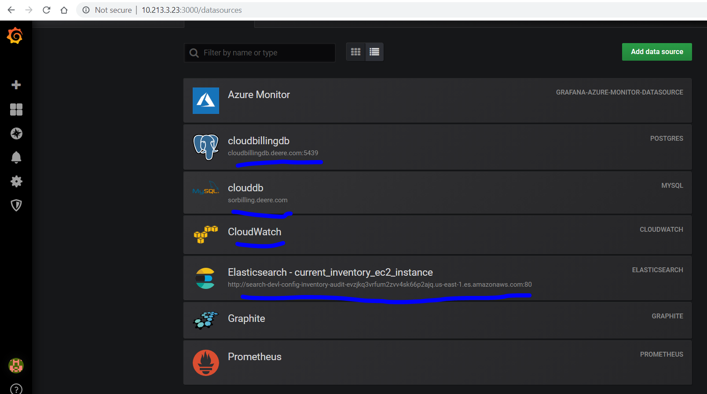
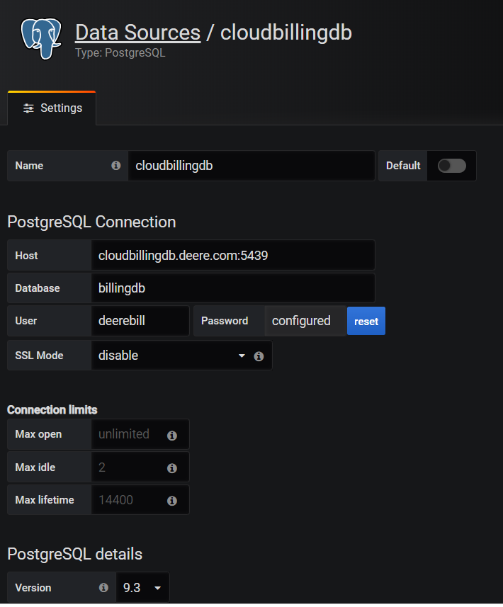
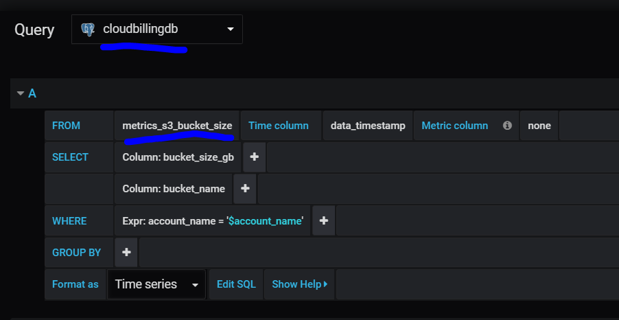

# Grafana Plugins

Grafana has several plugins that can be used to add data sources to graphs.  This is one of main advantages of Grafana vs other dashboards, like Kibana which can only import ElasticSearch clusters.

Plugins do need to be configured with hostname, ports and credentials:

Once they are set up, then they can be used to create dashboards:

# Links

[Grafana Plugins](https://grafana.com/grafana/plugins)