# Grafana Variables

You can declare variables in Grafana to be used in queries and to add dropdowns to Dashboards.

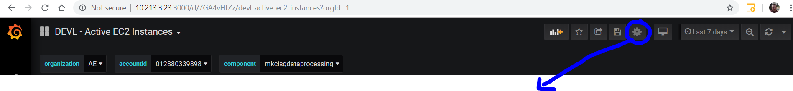
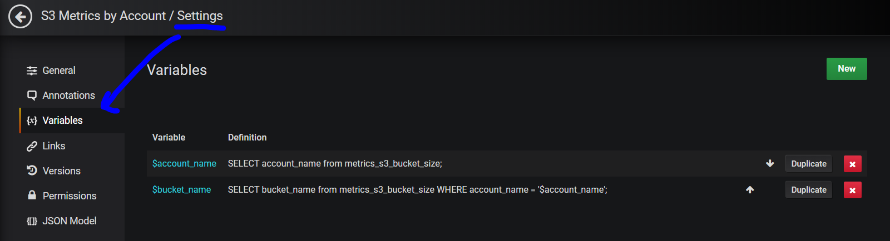

When creating a variable, think of it as a query statement you would make to get a list of things, like a list of AWS accounts or S3 bucket names:

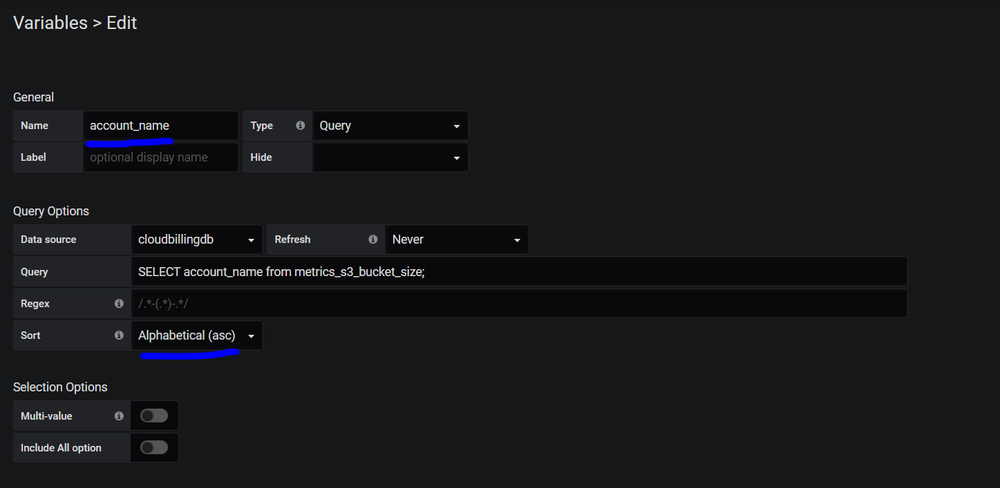

Once these variables are defined, they can be used to create new visualizations:

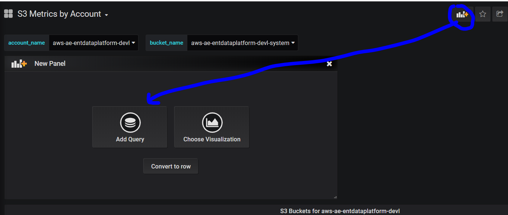

From here, you can use a WHERE statement just like you would in a SQL query to limit results from the dropdown to the selected variable:

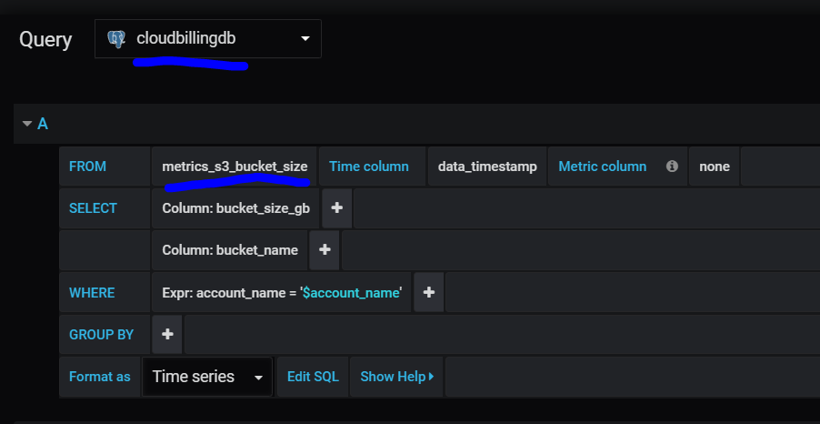

!!! note
    It's very important to wrap your variable in single quotes or you may get errors.

At this point, when using the Dashboard, you can drop down to select the variables to only display information for a specific account or bucket:

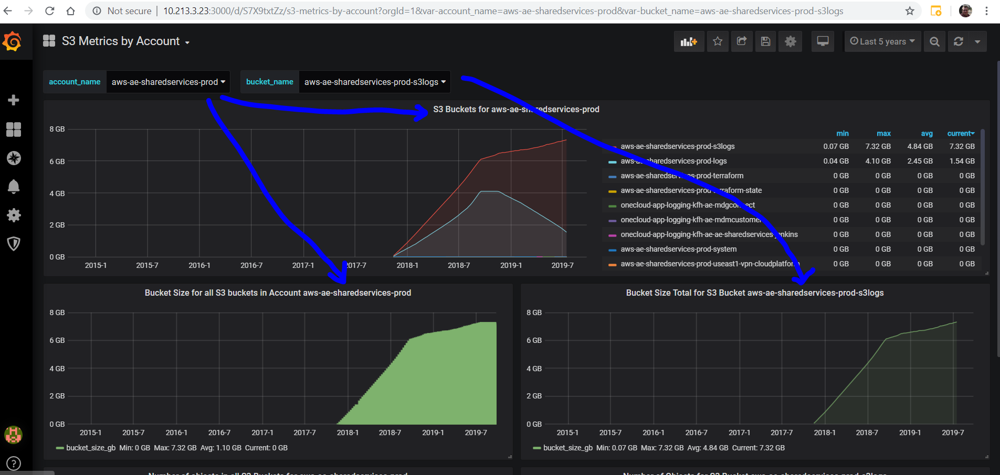

# Drop Down Menu Inheritance - ElasticSearch

Say for example, you want to select one menu, which the next drop down menu so you can really dial down into something.

For example: Organization > AWS Account > Component

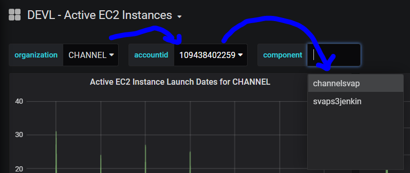

This is an ElasticSearch example, so to create these variables, you would use the "query" filter with the previous variable to drill down:

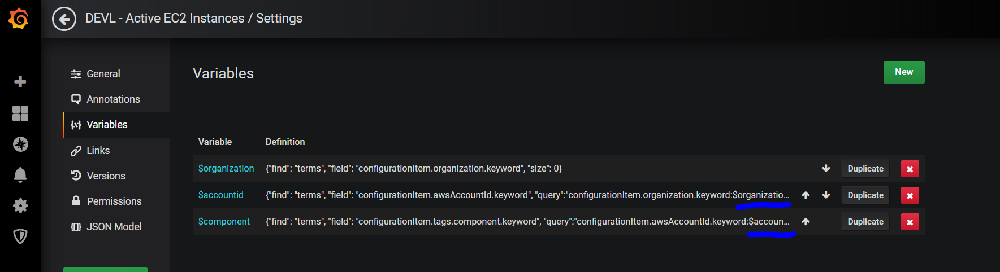

The organization is just a list of all Organization keywords:

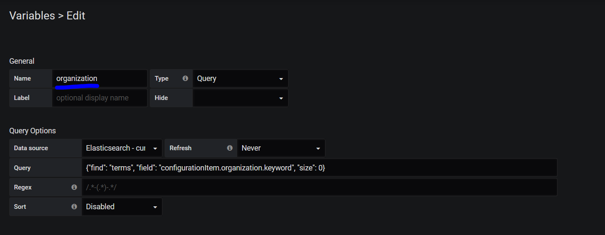

Next is get the AWS Account ID and filter by Organization:

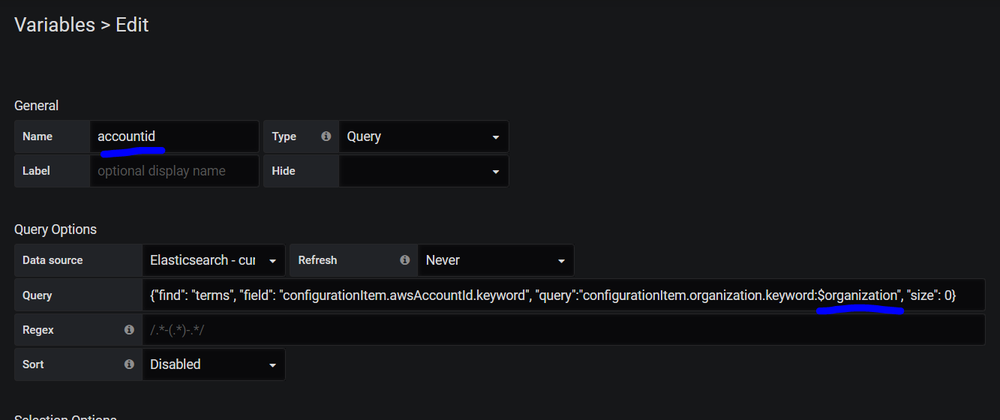

Next is to get all Components and filter by AWS Account ID:

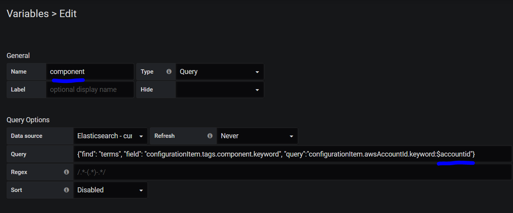

# Drop Down Menu Inheritance - SQL

This works the same way, but with SQL statements:

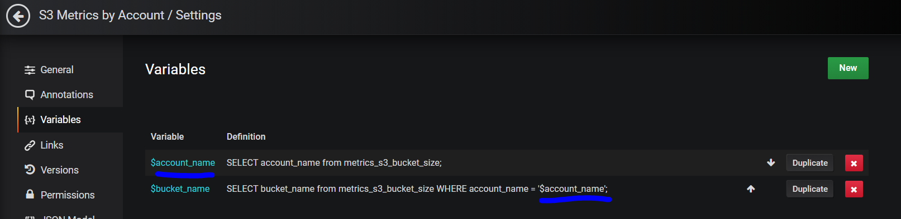

First create a list using a standard SQL statement:

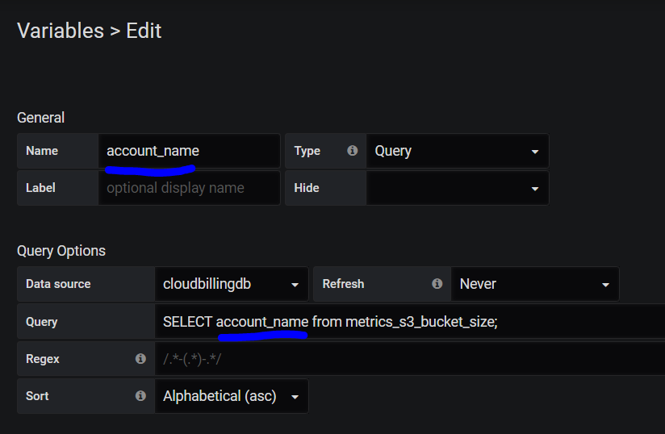

Next, use a SQL statement with a WHERE clause to filter by AWS Account:

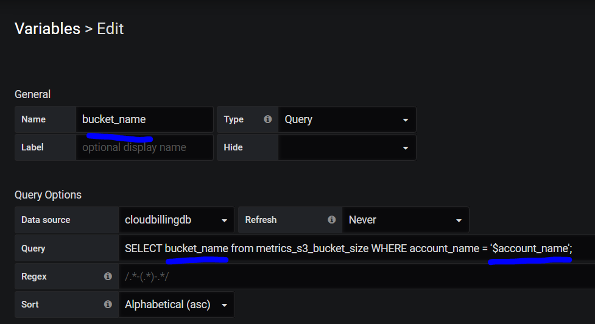

The end result is that when you pick and AWS Account Name, it will then show all the S3 Buckets for that AWS Account:

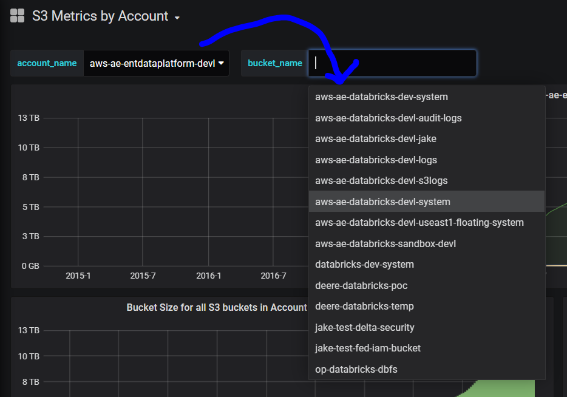

# Saving dropdown variables as default values for the dashboard

Some dashboards you create or download may default to the first variable in the dropdown list and this may not be the correct desired result.  If you want a different variable to be the default value in the dashboard, then select the default variable, then save the dashboard and select "save current variables" before saving.

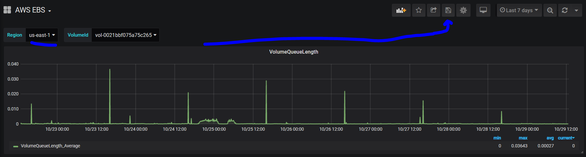

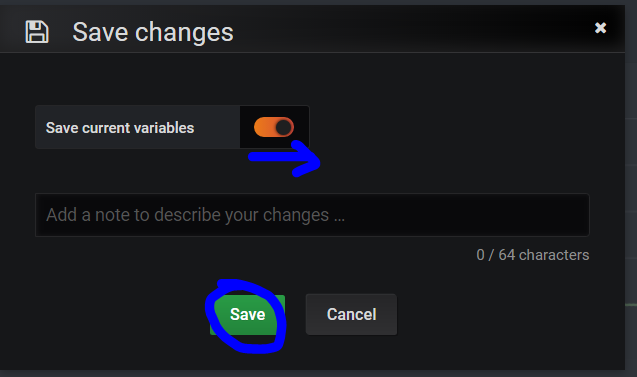