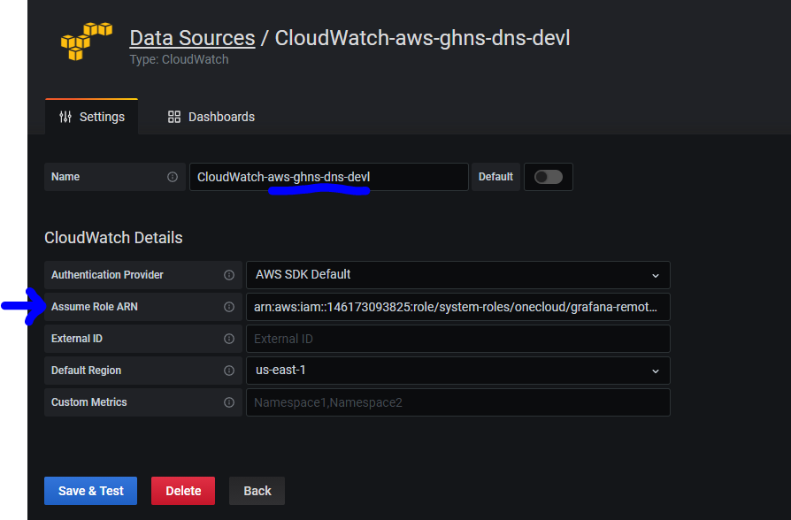
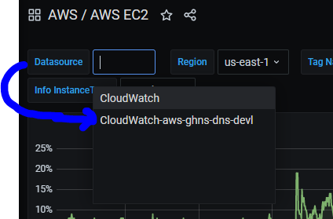
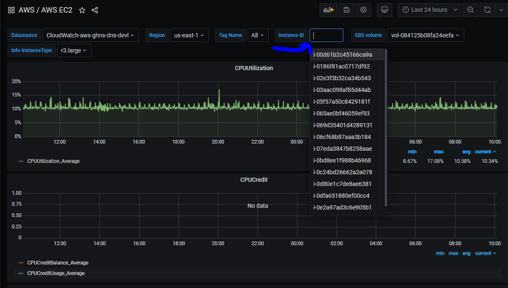

# Cloudwatch Plugin for Grafana Cross Account
The Cloudwatch plugin does allow for cross account if you set it up to assume role to that account.

# Accounts
## Account A
* jd-us01-ghns-sharedservices 815275185692 with Grafana installed on an EC2 or ECS instance with the role:
    * <b>arn:aws:iam::815275185692:role/system-roles/onecloud/onecloud-devtools-automation-task</b> attached to it. 
    * This role has default permissions for CloudWatch via policy: 
        * <b>arn:aws:iam::815275185692:policy/system-policies/cloudwatchreader</b>


## Account B 
* aws-ghns-dns-devl 146173093825 – an account where we would like to get information from CloudWatch.

By default, we have access to CloudWatch in an account where Grafana installed, but to get access to another account we should configure assume the role for Grafana.

# Policies

Example policies for Cloudwatch:

1. A cloudwatch policy in the remote account:

```
{
  "Version": "2012-10-17",
  "Statement": [
    {
      "Sid": "AllowReadingMetricsFromCloudWatch",
      "Effect": "Allow",
      "Action": [
        "cloudwatch:DescribeAlarmsForMetric",
        "cloudwatch:DescribeAlarmHistory",
        "cloudwatch:DescribeAlarms",
        "cloudwatch:ListMetrics",
        "cloudwatch:GetMetricStatistics",
        "cloudwatch:GetMetricData"
      ],
      "Resource": "*"
    },
    {
      "Sid": "AllowReadingLogsFromCloudWatch",
      "Effect": "Allow",
      "Action": [
        "logs:DescribeLogGroups",
        "logs:GetLogGroupFields",
        "logs:StartQuery",
        "logs:StopQuery",
        "logs:GetQueryResults",
        "logs:GetLogEvents"
      ],
        "Resource": [
        "arn:aws:logs:us-east-1:ACCOUNT_NUMBER_HERE:log-group*"
      ]
    },
    {
      "Sid": "AllowReadingTagsInstancesRegionsFromEC2",
      "Effect": "Allow",
      "Action": ["ec2:DescribeTags", "ec2:DescribeInstances", "ec2:DescribeRegions"],
      "Resource": "*"
    },
    {
      "Sid": "AllowReadingResourcesForTags",
      "Effect": "Allow",
      "Action": "tag:GetResources",
      "Resource": "*"
    }
  ]
}
```

Example policy: https://github.deere.com/cloud/policy-management/blob/master/policies/aws-ghns-dns-devl/iam-policies/system-policies/cloudwatchreader

2. An Assume policy that allows assume role in remote account:
```
{
  "Version": "2012-10-17", 
  "Statement": [
    {
      "Action": [
        "sts:AssumeRole"
      ], 
      "Resource": [
        "arn:aws:iam::815275185692:role/system-roles/onecloud/onecloud-devtools-automation-task",
        "arn:aws:sts::815275185692:assumed-role/onecloud-devtools-automation-task/5935e8f0d7a7443a850e7f5078386d48"
      ], 
      "Effect": "Allow", 
      "Sid": ""
    }
  ]
}
```

Example policy: https://github.deere.com/cloud/policy-management/blob/master/policies/aws-ghns-dns-devl/iam-policies/system-policies/grafana-remote-cloudwatch

3. An Assume policy that allows assume role in remote account:

```
{
    "Version": "2012-10-17",
    "Statement": [
        {
            "Effect": "Allow",
            "Action": "sts:AssumeRole",
            "Resource": "arn:aws:iam::ACCOUNT_NUMBER_HERE:role/system-roles/onecloud/onecloud-devtools-automation-task"
        }
    ]
}
```

Example policy: https://github.deere.com/cloud/policy-management/blob/master/policies/aws-ghns-dns-devl/iam-policies/system-policies/assume-role-cloudwatch

4. An Assume policy that allows to assume role from local account:

```
{
  "Version": "2012-10-17", 
  "Statement": [
    {
      "Action": [
        "sts:AssumeRole"
      ], 
      "Resource": [
        "arn:aws:iam::146173093825:role/system-roles/onecloud/grafana-remote-cloudwatch"
      ], 
      "Effect": "Allow", 
      "Sid": "GrafanaCloudwatchDevl"
    },
    {
       "Action": [
          "sts:AssumeRole"
        ],
        "Resource": [
          "arn:aws:iam::252183797608:role/system-roles/onecloud/grafana-remote-cloudwatch"
        ],
        "Effect": "Allow",
        "Sid": "GrafanaCloudwatchProd"
     }
  ],
   "Tags": {
           "SetAsDefault": true,
           "component": ["onecloud-devtool-automation","oncloud-automation-bot"]
         }
}
```

Example policy: https://github.deere.com/cloud/policy-management/blob/master/policies/jd-us01-ghns-sharedservices/iam-policies/system-policies/onecloud/grafana-remote-cloudwatch

# Roles
1. Create role in remote account for grafana-remote-cloudwatch

```
{
    "AssumeRolePolicyDocument": {
      "Statement": [
        {
          "Action": "sts:AssumeRole",
          "Effect": "Allow",
          "Principal": {
            "AWS": [
                "arn:aws:sts::815275185692:assumed-role/onecloud-devtools-automation-task/5935e8f0d7a7443a850e7f5078386d48"
             ],
             "Service": ["ecs.amazonaws.com"]
          },
          "Sid": "AssumeRole"
        }
      ],
      "Version": "2012-10-17"
	},
	"AttachedPolicies": [
	{
          "PolicyArn": "arn:aws:iam::ACCOUNT_NUMBER_HERE:policy/base-policies/global-consolidated-denies",
          "PolicyName": "global-consolidated-denies"
        }, 
        {
          "PolicyArn": "arn:aws:iam::ACCOUNT_NUMBER_HERE:policy/base-policies/global-read-only-metadata-only",
          "PolicyName": "global-read-only-metadata-only"
        },
	{
          "PolicyArn": "arn:aws:iam::ACCOUNT_NUMBER_HERE:policy/system-policies/grafana-remote-cloudwatch",
          "PolicyName": "grafana-remote-cloudwatch"
        },
	{
          "PolicyArn": "arn:aws:iam::ACCOUNT_NUMBER_HERE:policy/system-policies/cloudwatchreader",
          "PolicyName": "cloudwatchreader"
        }
	],
	"Tags": {
		"component": ["onecloud-devtool-automation","oncloud-automation-bot"]
	}
}
```

Example role: https://github.deere.com/cloud/global-role-management/blob/master/roles/aws-ghns-dns-devl/iam-roles/system-roles/onecloud/grafana-remote-cloudwatch

!!! note 
    If using ECS or EC2, you will need to get the ECS instance name or EC2 instance name as part of the arn.

2. Update existing Grafana role in local account that includes policy for grafana-remote-cloudwatch:
```
{
	"AssumeRolePolicyDocument": {
		"Statement": [{
			"Action": "sts:AssumeRole",
			"Effect": "Allow",
			"Principal": {
				"Service": [
					"ecs-tasks.amazonaws.com"
				]
			},
			"Sid": ""
		}],
		"Version": "2012-10-17"
	},
	"AttachedPolicies": [{
			"PolicyArn": "arn:aws:iam::ACCOUNT_NUMBER_HERE:policy/system-policies/onecloud/onecloud-devtools-automation-task",
			"PolicyName": "onecloud-devtools-automation-task"
		},
                {
                        "PolicyArn": "arn:aws:iam::ACCOUNT_NUMBER_HERE:policy/system-policies/xrayreader",
                        "PolicyName": "xrayreader"
                },
		{
                        "PolicyArn": "arn:aws:iam::ACCOUNT_NUMBER_HERE:policy/system-policies/cloudwatchreader",
                        "PolicyName": "cloudwatchreader"
                },
	        {
                        "PolicyArn": "arn:aws:iam::ACCOUNT_NUMBER_HERE:policy/system-policies/onecloud-app-logging-ghns-reader",
                        "PolicyName": "onecloud-app-logging-ghns-reader"
                },
			        {
                        "PolicyArn": "arn:aws:iam::ACCOUNT_NUMBER_HERE:policy/system-policies/onecloud/grafana-remote-cloudwatch",
                        "PolicyName": "grafana-remote-cloudwatch"
                },
		{
			"PolicyArn": "arn:aws:iam::ACCOUNT_NUMBER_HERE:policy/system-policies/onecloud/onecloud-devtools-automation-task-secret",
			"PolicyName": "onecloud-devtools-automation-task-secret"
		},
		{
			"PolicyArn": "arn:aws:iam::ACCOUNT_NUMBER_HERE:policy/base-policies/global-network-denies",
			"PolicyName": "global-network-denies"
		},
		{
			"PolicyArn": "arn:aws:iam::ACCOUNT_NUMBER_HERE:policy/base-policies/global-policy-denies",
			"PolicyName": "global-policy-denies"
		},
		{
			"PolicyArn": "arn:aws:iam::ACCOUNT_NUMBER_HERE:policy/base-policies/global-accounting-denies",
			"PolicyName": "global-accounting-denies"
		}
	],
	"Tags": {
		"component": ["onecloud-devtool-automation","oncloud-automation-bot"]
	}
}
```
grafana role: https://github.deere.com/cloud/global-role-management/blob/master/roles/jd-us01-ghns-sharedservices/iam-roles/system-roles/onecloud/onecloud-devtools-automation-task

After creating the roles and policies, you can add a new Cloudwatch datasource using the <b>Assume Role ARN</b> of the role created in the remote account:


Some, but not all AWS dashboards will have a drop down to pick the new Cloudwatch datasource:


After seleting the new datasource, Cloudwatch metrics should be visible:


# Links
https://www.devopscat.tech/2020/05/role-assuming-between-two-aws-accounts-for-grafana-access/
