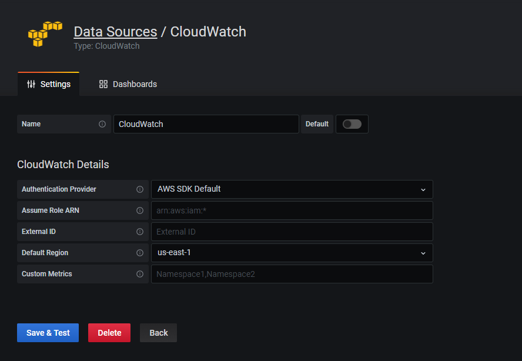

# Cloudwatch Plugin for Grafana

If Grafana is installed on an EC2 or other AWS resource, then it can inherit the role that is assigned to that AWS resource

To use the cloudwatch plugin, just set up with AWS SDK Default and a Default Region:



# IAM Permissions

IAM permissions are needed in the AWS resource's policy to read from Cloudwatch:

```
{
  "Version": "2012-10-17",
  "Statement": [
    {
      "Sid": "AllowReadingMetricsFromCloudWatch",
      "Effect": "Allow",
      "Action": [
        "cloudwatch:DescribeAlarmsForMetric",
        "cloudwatch:DescribeAlarmHistory",
        "cloudwatch:DescribeAlarms",
        "cloudwatch:ListMetrics",
        "cloudwatch:GetMetricStatistics",
        "cloudwatch:GetMetricData"
      ],
      "Resource": "*"
    },
    {
      "Sid": "AllowReadingLogsFromCloudWatch",
      "Effect": "Allow",
      "Action": [
        "logs:DescribeLogGroups",
        "logs:GetLogGroupFields",
        "logs:StartQuery",
        "logs:StopQuery",
        "logs:GetQueryResults",
        "logs:GetLogEvents"
      ],
        "Resource": [
        "arn:aws:logs:us-east-1:ACCOUNT_NUMBER_HERE:log-group*"
      ]
    },
    {
      "Sid": "AllowReadingTagsInstancesRegionsFromEC2",
      "Effect": "Allow",
      "Action": ["ec2:DescribeTags", "ec2:DescribeInstances", "ec2:DescribeRegions"],
      "Resource": "*"
    },
    {
      "Sid": "AllowReadingResourcesForTags",
      "Effect": "Allow",
      "Action": "tag:GetResources",
      "Resource": "*"
    }
  ]
}
```

Per: https://grafana.com/docs/grafana/latest/datasources/cloudwatch/

Example policy: https://github.deere.com/cloud/policy-management/blob/master/policies/jd-us01-ghns-sharedservices/iam-policies/system-policies/cloudwatchreader

Attach it to the role of the ec2 or ecs task:

```
{
                        "PolicyArn": "arn:aws:iam::ACCOUNT_NUMBER_HERE:policy/system-policies/cloudwatchreader",
                        "PolicyName": "cloudwatchreader" 
},
```

Example role: https://github.deere.com/cloud/global-role-management/blob/master/roles/jd-us01-ghns-sharedservices/iam-roles/system-roles/onecloud/onecloud-devtools-automation-task

# Dashboards
After testing, there are several dashboards that can be imported:

https://grafana.com/grafana/dashboards?dataSource=cloudwatch

The OneCloud Support team uses most of the Cloudwatch based metrics provided by the community, but any modified dashboards are located here:

https://github.deere.com/onecloud-operations/grafana-dashboards/tree/master/aws

# Limitations

* Currently the Cloudwatch plugin can not read Cloudwatch metrics in other accounts (cross account).
    * AWS recently added support for cross account Cloudwatch metrics, but this had not made it into the Grafana Cloudwatch yet.
