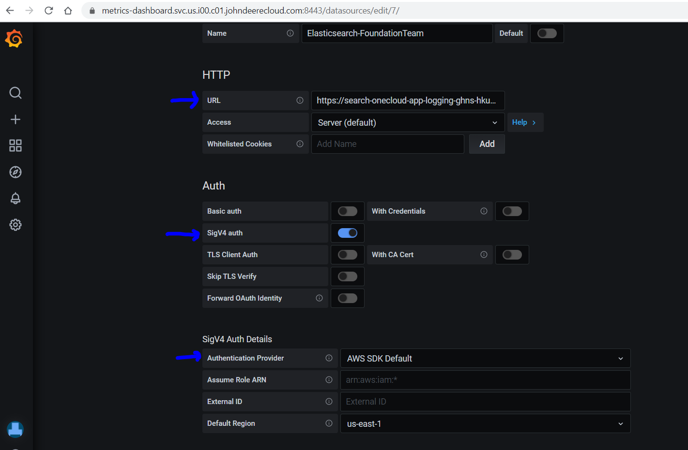
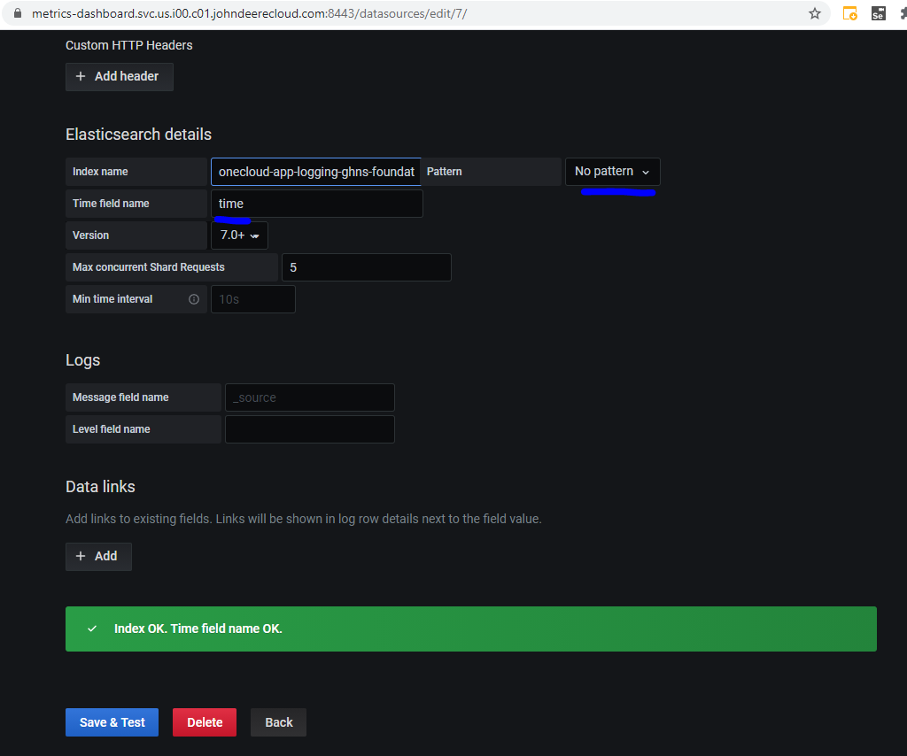
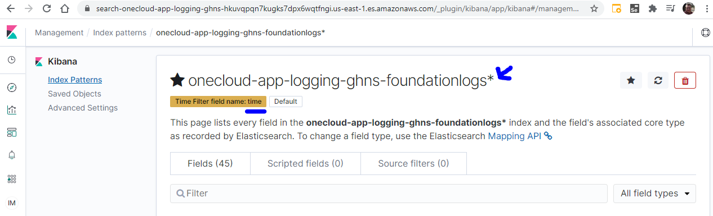

# ElasticSearch Plugin for Grafana

If Grafana is installed on an EC2 or other AWS resource, then it can inherit the role that is assigned to that AWS resource

To use the elasticsearch plugin for an AWS ElasticSearch domain, define the URL, switch on SigV4 auth, set to "AWS SDK Default" and a default region:




To get the <b>Index name</b> and <b>Time field name</b>, you can review these in the Kibana instance of your AWS ElasticSearch domain:


# IAM Permissions

IAM permissions are needed in the AWS resource's policy to read from ElasticSearch:

```
{
    "Version": "2012-10-17",
    "Statement": [
        {
            "Effect": "Allow",
            "Action": [
              "es:ESHttpGet",
              "es:ESHttpHead",
	          "es:ESHttpPost"
            ],
            "Resource": [
               "arn:aws:es:us-east-1:ACCOUNT_NUMBER_HERE:domain/onecloud-app-logging-ghns",
               "arn:aws:es:us-east-1:ACCOUNT_NUMBER_HERE:domain/onecloud-app-logging-ghns/*"
            ]
        }
    ]
}
```

Example policy: https://github.deere.com/cloud/policy-management/blob/master/policies/jd-us01-ghns-sharedservices/iam-policies/system-policies/onecloud-app-logging-ghns-reader

Attach it to the role of the ec2 or ecs task:
```
	        {
                        "PolicyArn": "arn:aws:iam::ACCOUNT_NUMBER_HERE:policy/system-policies/onecloud-app-logging-ghns-reader",
                        "PolicyName": "onecloud-app-logging-ghns-reader"
            },
```

Example role: https://github.deere.com/cloud/global-role-management/blob/master/roles/jd-us01-ghns-sharedservices/iam-roles/system-roles/onecloud/onecloud-devtools-automation-task

# Dashboards

After testing, there are several dashboards that can be imported:

https://grafana.com/grafana/dashboards?dataSource=elasticsearch

The Onecloud team is testing out AWS ElasticSearch for Site Reliability Engineering initiatives and our AWS ElasticSearch based dashboards are stored here:

https://github.deere.com/onecloud-operations/grafana-dashboards/tree/master/sre

# Limitations

* ElasticSearch support for AWS SigV4 is supported in Grafana 7.3+ which was released on 10/28/20
    * Grafana 7.3 early beta releases have bug for AWS SigV4:
      https://github.com/grafana/grafana/issues/28519
      https://github.com/grafana/grafana/pull/28481
