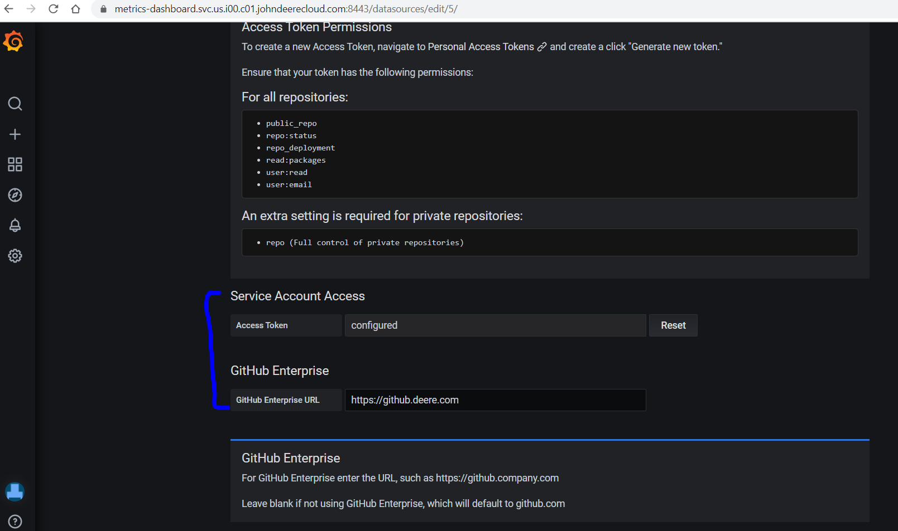
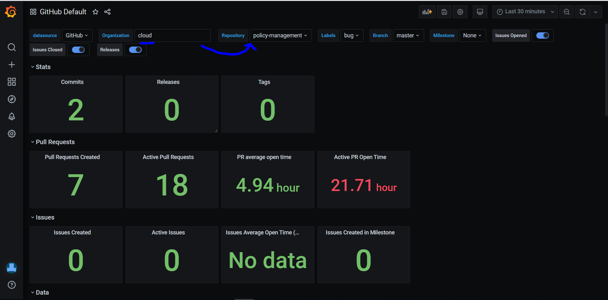

# GitHub Plugin for Grafana

Grafana has a github datasource that now supports GitHub Enterprise and the version of GitHub Enterprise at https://github.deere.com supports all the request headers for this datasource

To use the github plugin, just set up the plugin with the GitHub Enterprise server URL and a Personal Access Token created in github.deere.com

# IAM Permissions

Not Required

# Firewall Access

Not Required

* Most if not all accounts in the VPN/Jenkins networks should have access to https://github.deere.com

# Dashboards

After testing, there is just one dashboard that can be imported right now:

https://github.com/grafana/github-datasource/tree/master/src/dashboards

After setting up the dashboard, you can search by Organization, which will refresh the Repository list.

# Limitations

* You will only get back results from repos and organizations that your Personal Access Token has access to.
