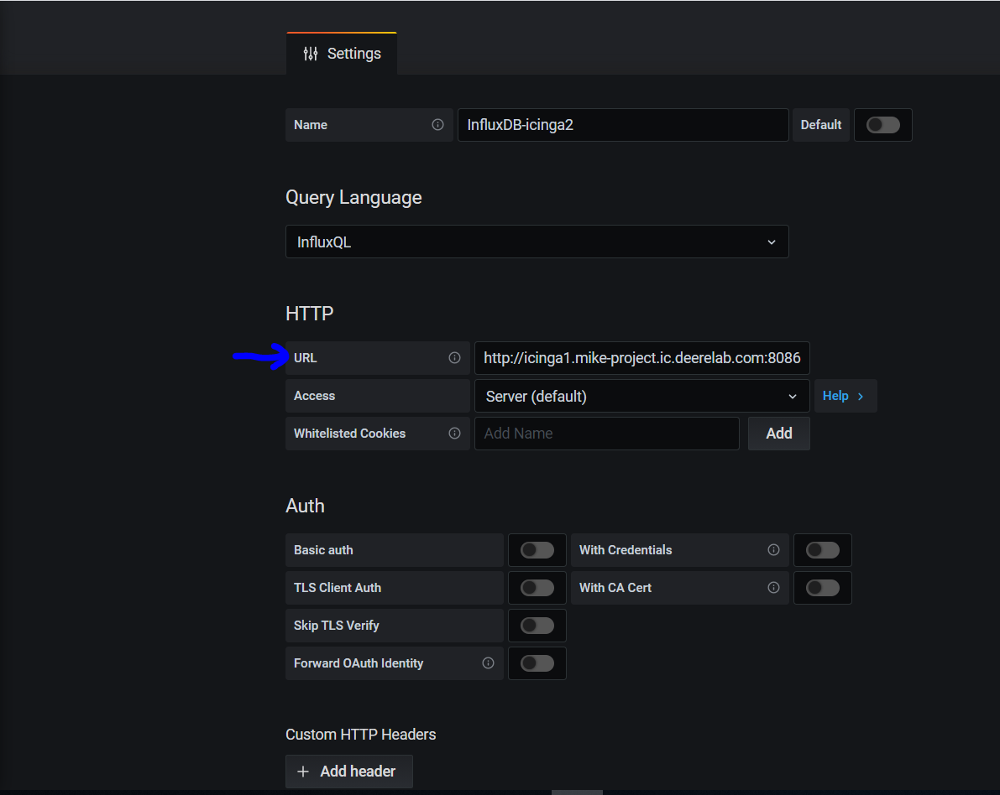
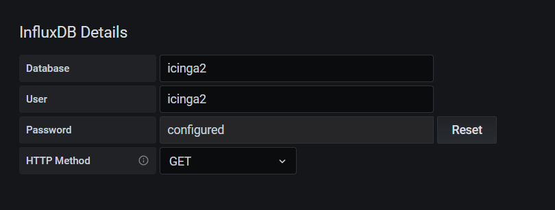

# InfluxDB Plugin for Grafana

Grafana comes standard with a plugin for InfluxDB.

# IAM Permissions

Not Required

# Firewall Access

May be required if your InfluxDB is in a different AWS account or on premise

# Dashboards

After testing, there are several dashboards that can be imported:

https://grafana.com/grafana/dashboards?dataSource=influxdb

# Icinga2 Integration

By default Icinga2 uses MySQL as the backend for storing check results.

You can query via MySQL in Grafana, but these queries can sometimes be slow and data will pull much faster in a time series database like InfluxDB

Install InfluxDB on Icinga2:

* Refer to: https://confluence.deere.com/display/ONECLOUD/Icinga2+InfluxDB

##  Dashboards

After testing, there are several dashboards that can be imported:

https://github.deere.com/onecloud-operations/grafana-dashboards/tree/master/icinga2

# Limitations

* None known