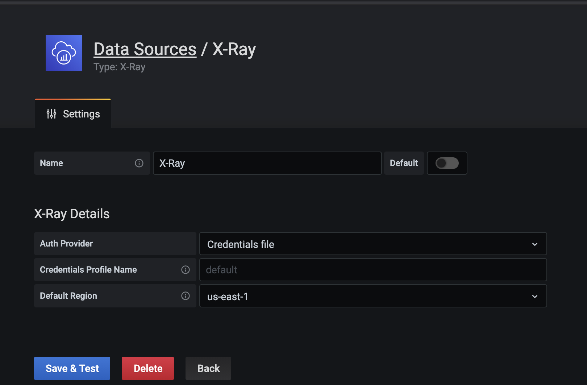
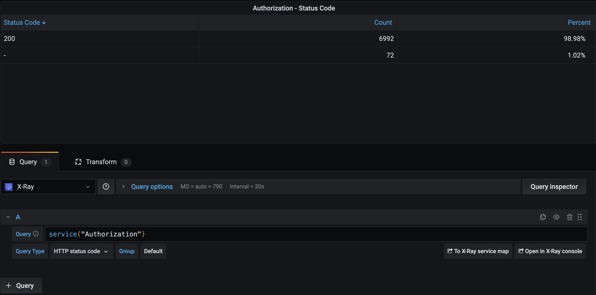

# X-Ray Plugin for Grafana

If Grafana is installed on an EC2 or other AWS resource, then it can inherit the role that is assigned to that AWS resource

Add the X-Ray Data Source in confluence as credentials file with default location using proper region as X-Ray data:



# IAM Permissions
IAM permissions are needed in the AWS resource's policy to read from X-Ray:

```
{
    "Version": "2012-10-17",
    "Statement": [
        {
            "Effect": "Allow",
            "Action": [
                "xray:BatchGetTraces",
                "xray:GetGroups",
                "xray:GetGroup",
                "xray:GetInsightSummaries",
                "xray:GetInsight",
                "xray:GetSamplingRules",
                "xray:GetSamplingTargets",
                "xray:GetSamplingStatisticSummaries",
                "xray:GetServiceGraph",
                "xray:GetTimeSeriesServiceStatistics",
                "xray:GetTraceGraph",
                "xray:GetTraceSummaries"
            ],
            "Resource": [
                "*"
            ]
        }
    ]
}
```

Example policy: https://github.deere.com/cloud/policy-management/blob/master/policies/jd-us01-ghns-sharedservices/iam-policies/system-policies/xrayreader

Attach it to the role of the ec2 or ecs task:

```
{
                        "PolicyArn": "arn:aws:iam::ACCOUNT_NUMBER_HERE:policy/system-policies/xrayreader",
                        "PolicyName": "xrayreader" 
},
```

Example role: https://github.deere.com/cloud/global-role-management/blob/master/roles/jd-us01-ghns-sharedservices/iam-roles/system-roles/onecloud/onecloud-devtools-automation-task


# Dashboards

Since X-Ray is a new plugin, there are no public dashboards created yet.

The Onecloud team is testing out X-Ray for Site Reliability Engineering initiatives and our X-Ray based dashboards are stored here:

https://github.deere.com/onecloud-operations/grafana-dashboards/tree/master/sre

## X-Ray Filtering

To query by X-Ray service name: service("SERVICE_NAME_HERE")

Response time greater than 1 second: responseTime > 1 

You can stack queries and adjust data by changing query type:



You can review X-Ray [Console Filters](https://docs.aws.amazon.com/xray/latest/devguide/xray-console-filters.html) to find more examples of queries

# Limitations

* Currently the X-Ray plugin can only query up to 24 hours back in time.
    * This appears to be a limitation in the plugin as you can review more than 24 hours in the past from within the AWS X-Ray Console.
