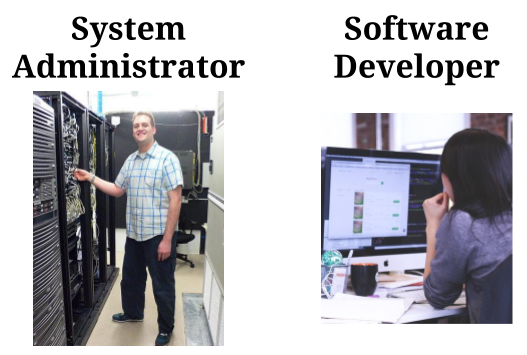
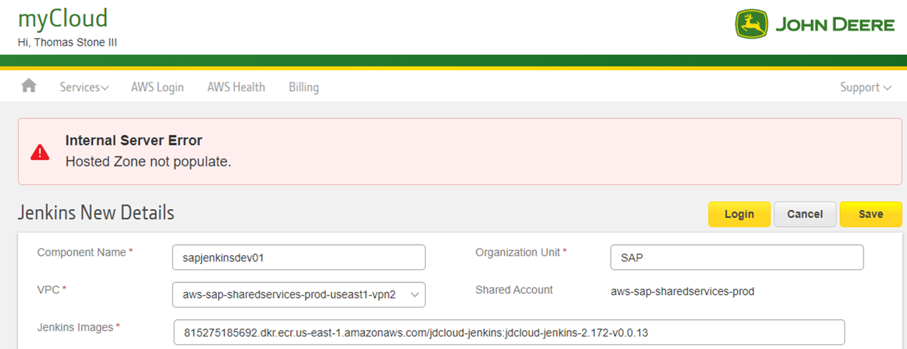

# Overview
SRE is what you get when you treat operations as if it’s a software problem — with an ever-watchful eye on their availability, latency, performance, and capacity.

SRE is a team and implementation strategy to incentivize quality and operations within your development teams.

# Operations vs Developers, DevOps vs SRE
Traditionally, developers and sysadmins are divided into discrete teams: 

* "development"
* "operations" or "ops."

SRE is a way to bridge the gap between developers and IT operations, even in a DevOps culture. It isn’t SRE vs. DevOps – it’s SRE with DevOps.

DevOps defines the "what":
- DevOps emerged as a culture and a set of practices that aims to reduce the gaps between software development and software operation. However, the DevOps movement does not explicitly define how to succeed in these areas.

SRE defines the "how":
* SRE, which evolved at Google to meet internal needs in the early 2000s independently of the DevOps movement, happens to embody the philosophies of DevOps, but has a much more prescriptive way of measuring and achieving reliability through engineering and operations work.

# What is Reliability?

Reliability can be defined as the probability that a system will produce correct outputs up to some given time.​

4 Golden Signals:

1. Latency - How long does it take to service a request?
* Example: Example: mycloud.deere.com list accounts makes an API call to return results of all accounts

2. Traffic - How much stress is your system taking on from the number of users or transactions running through your service?
* Example: Number of concurrent transactions to visit mycloud.deere.com

3. Errors - defined based on manually defined logic or they’re explicit errors such as a failed HTTP request
* Example: User tries to enter new component, but gets failure

4. Saturation - define a metric for saturation that means the service is maxed out
* Example: Number of concurrent connections to a backend database or API on mycloud

Other Factors:

1. Availability - uptime vs downtime
* Example: mycloud is up or down

2. Response time​ - time to get to resource
* Example: time it takes to get to mycloud

3. Correctness​ - data being presented is correct
* Example: sync issue between ServiceNow and mycloud causes data to not be correct in one of the systems

4. Freshness - data being presented is up to date
* Example: update of data not showing up in mycloud 

# How Reliable?

The key to SRE is to able to balance your error budget against engineering time, development velocity and money.

When a user: 

* is not able to access a site
* encounters an error on the site

Then, the site in their experience becomes more unreliable.

??? Note
    None of our services need 100% availability and/or reliabilty
    The SLO needs to be realistic

# What is an SLO?

SLO is a set goal for how well the system should behave which includes the availability and customer experience.​

* If customers are happy, then the SLO is achieved.

# What is an SLI?

SLI is a service level indicator

* A carefully defined quantitative measure of some aspect of the level of service that is provided.
    * Latency, Availability, Error Rate, Throughput, Response Time, Durability

# What is an Error Budget?

* Error Budgets are a framework for managing risk and bringing balance between development and SREs. 
    * measure how much risk we are willing to tolerate in a service. 
    * as long as the measured uptime/availability is above the SLA/SLO, there is an error budget remaining.
    * new features and releases can be pushed to production.

[Availability Table](https://landing.google.com/sre/sre-book/chapters/availability-table/) 

# Monitoring

Monitoring is one of the primary means by which service owners keep track of a system’s health and availability. 

There are three kinds of valid monitoring output:

* Alerts - human needs to take action immediately in response to something that is either happening or about to happen, in order to improve the situation.
* Tickets - a human needs to take action, but not immediately. 
* Logging - recorded for diagnostic or forensic purposes. 

[Google SRE - Monitoring](https://landing.google.com/sre/workbook/chapters/monitoring/) 
[Monitoring for Golden Signals](https://landing.google.com/sre/sre-book/chapters/monitoring-distributed-systems/#xref_monitoring_golden-signals) 

# Incident and Change Management

Emergency Response:
Reliability is a function of mean time to failure (MTTF) and mean time to repair (MTTR). 

* Humans add latency to resolving issues
* Playbooks/practice ahead of time to reduce MTTR

Change Management:

* Roughly 70% of outages are due to changes in a live system
    * Implementing progressive rollouts
    * Quickly and accurately detecting problems

# The 3 R’s of SREs: Resiliency, Recovery & Reliability

* Resiliency is the ability to avoid or mitigate impact from an adverse event by quickly responding to, and fully recovering after, a failure. 
    * A focus on resiliency typically amounts to an emphasis on high availability. 
    * This allows for increased uptime.

* Recovery is the ability to restore service when failure occurs. As mentioned above, recovery is essential to strong resilience. 
    * Recovery directly impacts Recovery Time Objective (RTO), the time duration for an application to return to normal service levels after a failure, and Recovery Point Objective (RPO), the tolerance to data loss in terms of time duration. 
    * A focus on recovery typically leads to a well founded understanding of both design time and runtime dependencies due to the need to determine recovery methods for all possible failure points. This allows for the elimination of single points of failure and protection against potential failures and data loss.

* Reliability is the ability for a service to provide its expected functions. 
    * As laid out by Google for SRE, there are a number of concepts that go into reliability, ranging from technical execution to process and culture. 
    * A focus on reliability typically results in stability aligned to customer expectations. Note, stability in this context also includes security. 
    * A reliable system is one that is performant, secure, and meets service level objectives (SLOs), thereby instilling trust.

# SRE Videos

[Keys to SRE](https://www.usenix.org/conference/srecon14/technical-sessions/presentation/keys-sre) 
[Solving Reliability Fears with Site Reliability Engineering (Cloud Next '18)](https://www.youtube.com/watch?v=ZcZtU_TiFEM) 
[class SRE implements DevOps](https://www.youtube.com/playlist?list=PLIivdWyY5sqJrKl7D2u-gmis8h9K66qoj) 
* This video series is used in the Coursera class "Developing a Google SRE Culture"
[Service Level and Error Budgets](https://www.usenix.org/conference/srecon16/program/presentation/jones) 
[Best Practices from Google SRE: How You Can Use Them with GKE + Istio (Cloud Next '18)](https://www.youtube.com/watch?v=XPtoEjqJexs) 
[Life of an SRE at Google - JC van Winkel - Codemotion Rome 2017](https://www.youtube.com/watch?v=7Oe8mYPBZmw) 

# SRE Links

[Google: Site Reliability Engineering](https://landing.google.com/sre/sre-book/toc/index.html) 
[Google: The Site Reliability Workbook](https://landing.google.com/sre/workbook/toc/) 
[Site Reliability Engineering: Measuring and Managing Reliability (part 1)](https://etcnotes.com/posts/sre/) 
[Site Reliability Engineering: Measuring and Managing Reliability (part 2)](https://etcnotes.com/posts/sre-2/) 
[The 3 R’s of SREs: Resiliency, Recovery & Reliability](https://www.capitalone.com/tech/software-engineering/sres-architecting-with-resiliency-recovery-reliability/) 
[Site Reliability Engineer (SRE) Roles and Responsibilities](https://victorops.com/blog/site-reliability-engineer-sre-roles-and-responsibilities) 
[SRE vs. DevOps: competing standards or close friends?](https://cloud.google.com/blog/products/gcp/sre-vs-devops-competing-standards-or-close-friends) 
[Balance of Reliability and Innovation](https://medium.com/glasswall-engineering/balance-of-reliability-and-new-features-7435e8bc788a) 
