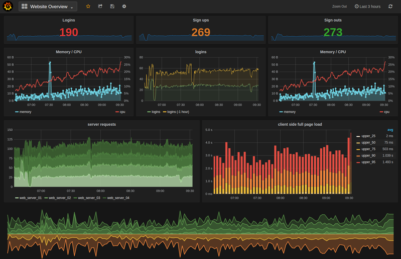
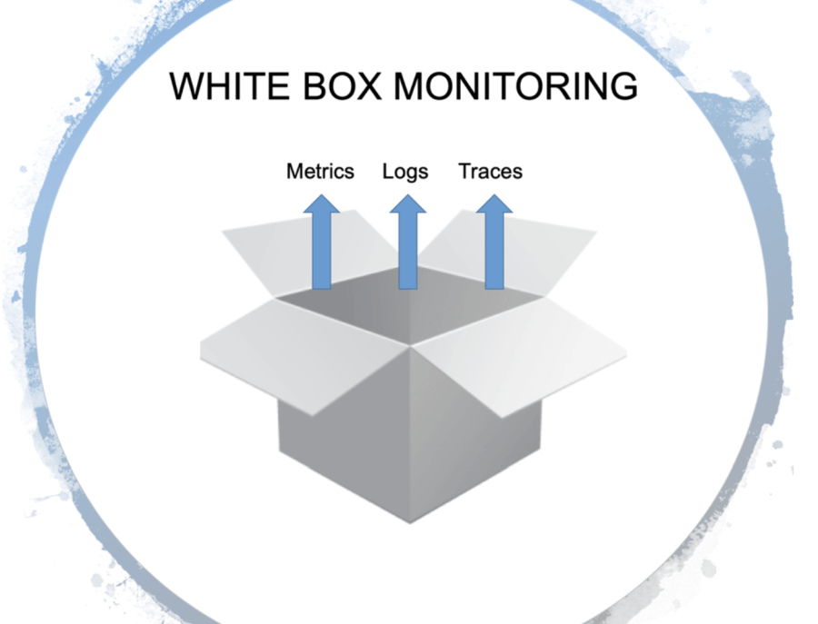
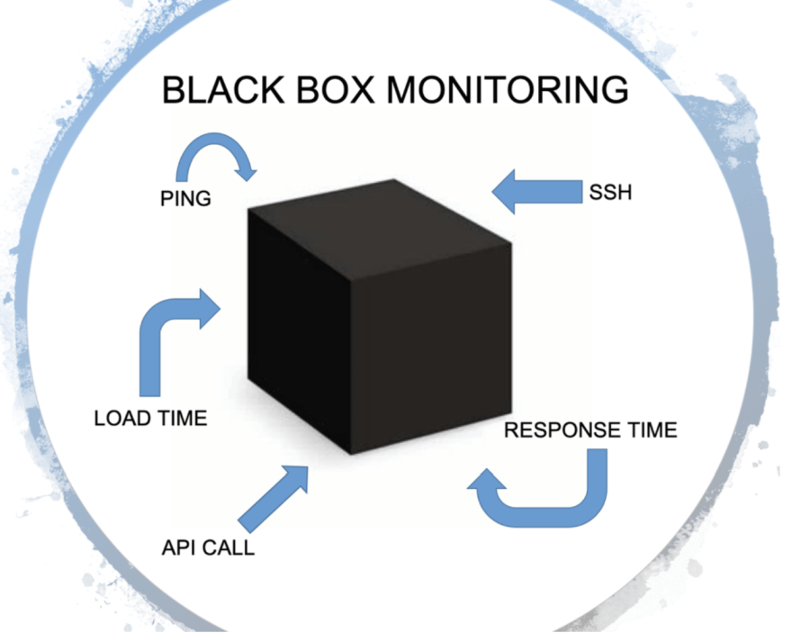
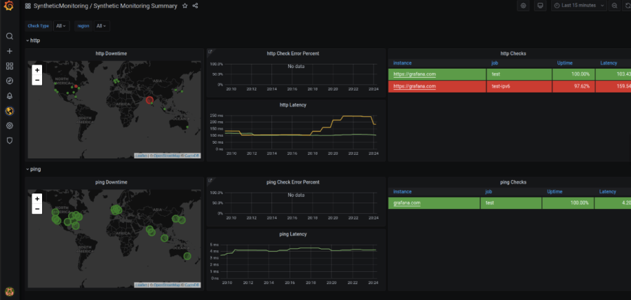
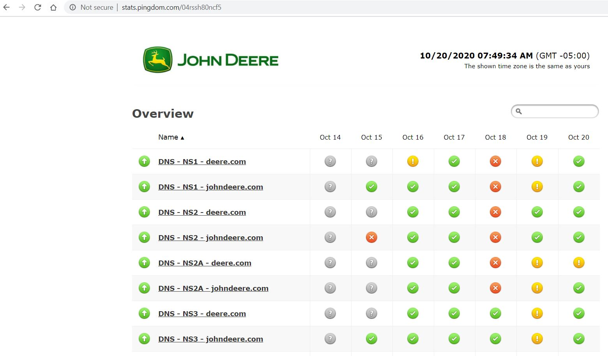

# Introduction to SRE Monitoring
Monitoring is collecting, processing, aggregating, and displaying real-time quantitative data about a system, such as query counts and types, error counts and types, processing times, and server lifetimes.

Monitoring is one of the primary means by which service owners keep track of a system’s health and availability. 

There are three kinds of valid monitoring output:

- Alerts - human needs to take action immediately in response to something that is either happening or about to happen, in order to improve the situation.
- Tickets - a human needs to take action, but not immediately. 
- Logging - recorded for diagnostic or forensic purposes. 

[Google SRE - Monitoring](https://landing.google.com/sre/workbook/chapters/monitoring/)

[Monitoring for Golden Signals](https://landing.google.com/sre/sre-book/chapters/monitoring-distributed-systems/#xref_monitoring_golden-signals)

# Kinds of Monitoring
There are several types of monitoring:

* Whitebox Monitoring
* Blackbox Monitoring
* Synthetic Monitoring
## Whitebox Monitoring
  * White-box monitoring depends on the ability to inspect the innards of the system, such as logs or HTTP endpoints, with instrumentation. White-box monitoring therefore allows detection of imminent problems, failures masked by retries, and so forth.
  * Tools like [Prometheus](https://prometheus.io/), [Grafana](https://grafana.com/) and [ElasticSearch](https://www.elastic.co/)
  * You can see <b>internal</b> metrics, logs and tracing

## Blackbox Monitoring
  * Black-box monitoring is symptom-oriented and represents active—not predicted—problems: "The system isn’t working correctly, right now.
  * Testing externally visible behavior as a user would see it.
  * Tools like [Nagios](https://www.nagios.com/), [Icinga](https://icinga.com/), [Zabbix](https://www.zabbix.com/)
  * You can only see <b>external</b> behavior like ping, ports, disk usage, but not know why the service isn't listening or why the disk filled up.

## Synthetic Monitoring
  * Synthetic monitoring helps you understand your user’s experience and improve website performance by proactively monitoring your services.
  * Synthetic monitoring is the best way to observe how systems and applications are performing by simulating the user experience.
  * Tools like [Grafana](https://grafana.com/) Synthetic Monitoring [plugin](https://grafana.com/grafana/plugins/grafana-synthetic-monitoring-app) and [agent](https://github.com/grafana/synthetic-monitoring-agent), [Pingdom](http://stats.pingdom.com/04rssh80ncf5), [Catchpoint](https://www.catchpoint.com/)

# Four Golden Signals

1. Latency - How long does it take to service a request?
    - Example: mycloud.deere.com list accounts makes an API call to return results of all accounts
2. Traffic - How much stress is your system taking on from the number of users or transactions running through your service?
    - Example: Number of concurrent transactions to visit mycloud.deere.com
3. Errors - defined based on manually defined logic or they’re explicit errors such as a failed HTTP request
    - Example: User tries to enter new component, but gets failure
4. Saturation - define a metric for saturation that means the service is maxed out
    - Example: Number of concurrent connections to a backend database or API om mycloud

# Other Monitoring Terms

* Dashboard
    - An application (usually web-based) that provides a summary view of a service’s core metrics. A dashboard may have filters, selectors, and so on, but is prebuilt to expose the metrics most important to its users. 
    - The dashboard might also display team information such as ticket queue length, a list of high-priority bugs, the current on-call engineer for a given area of responsibility, or recent pushes.

* Alert
    - A notification intended to be read by a human and that is pushed to a system such as a bug or ticket queue, an email alias, or a pager. Respectively, these alerts are classified as tickets, email alerts,22 and pages.

* Root cause
    - A defect in a software or human system that, if repaired, instills confidence that this event won’t happen again in the same way. 
    - A given incident might have multiple root causes: for example, perhaps it was caused by a combination of insufficient process automation, software that crashed on bogus input, and insufficient testing of the script used to generate the configuration. 
    - Each of these factors might stand alone as a root cause, and each should be repaired.

* Node and machine
    - Used interchangeably to indicate a single instance of a running kernel in either a physical server, virtual machine, or container. 
    - There might be multiple services worth monitoring on a single machine. The services may either be:
    - Related to each other: for example, a caching server and a web server
    - Unrelated services sharing hardware: for example, a code repository and a master for a configuration system like Puppet or Chef

* Push
    - Any change to a service’s running software or its configuration.

# Why Monitor
There are many reasons to monitor a system, including:

* Analyzing long-term trends
    * How big is my database and how fast is it growing? How quickly is my daily-active user count growing?

* Comparing over time or experiment groups
    * Are queries faster with Acme Bucket of Bytes 2.72 versus Ajax DB 3.14? How much better is my memcache hit rate with an extra node? Is my site slower than it was last week?

* Alerting
    * Something is broken, and somebody needs to fix it right now! Or, something might break soon, so somebody should look soon.

* Building dashboards
    * Dashboards should answer basic questions about your service, and normally include some form of the four golden signals (discussed in The Four Golden Signals).

* Conducting ad hoc retrospective analysis (i.e., debugging)
    * Our latency just shot up; what else happened around the same time?

# Desirable Features of a Monitoring Strategy
* Speed
    * Different organizations will have different needs when it comes to the freshness of data and the speed of data retrieval.
* Calculations
    * Support for calculations can span a variety of use cases, across a range of complexities. 
    * At a minimum, you’ll probably want your system to retain data over a multimonth time frame. * Without a long-term view of your data, you cannot analyze long-term trends like system growth. 
* Interfaces
    * A robust monitoring system should allow you to concisely display time-series data in graphs, and also to structure data in tables or a range of chart styles. 
    * Your dashboards will be primary interfaces for displaying monitoring, so it’s important that you choose formats that most clearly display the data you care about. Some options include heatmaps, histograms, and logarithmic scale graphs.
* Alerts
    * It’s helpful to be able to classify alerts: multiple categories of alerts allow for proportional responses. 
    * The ability to set different severity levels for different alerts is also useful: you might file a ticket to investigate a low rate of errors that lasts more than an hour, while a 100% error rate is an emergency that deserves immediate response.

# Sources of Monitoring Data
Your choice of monitoring system(s) will be informed by the specific sources of monitoring data you’ll use. This section discusses two common sources of monitoring data: logs and metrics. There are other valuable monitoring sources that we won’t cover here, like distributed tracing and runtime introspection.

* Metrics are numerical measurements representing attributes and events, typically harvested via many data points at regular time intervals. 
* Logs are an append-only record of events. 

# Managing Your Monitoring System
* Treat Your Configuration as Code
    * Treating system configuration as code and storing it in the revision control system are common practices that provide some obvious benefits: change history, links from specific changes to your task tracking system, easier rollbacks and linting checks,1 and enforced code review procedures.
    * We strongly recommend also treating monitoring configuration as code (for more on configuration, see Configuration Design and Best Practices). 
    * A monitoring system that supports intent-based configuration is preferable to systems that only provide web UIs or CRUD-style APIs. This configuration approach is standard for many open source binaries that only read a configuration file.
* Encourage Consistency
    * Large companies with multiple engineering teams who use monitoring need to strike a fine balance: a centralized approach provides consistency, but on the other hand, individual teams may want full control over the design of their configuration.
* Prefer Loose Coupling
    * Business requirements change, and your production system will look different a year from now. 
    * Similarly, your monitoring system needs to evolve over time as the services it monitors evolve through different patterns of failure.

As of this writing, there are at least two popular open standards for instrumenting your software and exposing metrics:

* statsd - The metric aggregation daemon initially written by Etsy and now ported to a majority of programming languages.
* Prometheus - An open source monitoring solution with a flexible data model, support for metric labels, and robust histogram functionality. Other systems are now adopting the Prometheus format, and it is being standardized as OpenMetrics.

# Metrics with Purpose
Alerting on SLOs covers how to monitor and alert using SLI metrics when a system’s error budget is under threat. SLI metrics are the first metrics you want to check when SLO-based alerts trigger. These metrics should appear prominently in your service’s dashboard, ideally on its landing page.

When investigating the cause of an SLO violation, you will most likely not get enough information from the SLO dashboards. These dashboards show that you are violating the SLO, but not necessarily why. What other data should the monitoring dashboards display?

* Intended Changes
    * When diagnosing an SLO-based alert, you need to be able to move from alerting metrics that notify you of user-impacting issues to metrics that tell you what is causing these issues. Recent intended changes to your service might be at fault. Add monitoring that informs you of any changes in production
* Dependencies
    * Even if your service didn’t change, any of its dependencies might change or have problems, so you should also monitor responses coming from direct dependencies.
* Saturation
    * Aim to monitor and track the usage of every resource the service relies upon. Some resources have hard limits you cannot exceed, like RAM, disk, or CPU quota allocated to your application. Other resources—like open file descriptors, active threads in any thread pools, waiting times in queues, or the volume of written logs—may not have a clear hard limit but still require management.
* Status of Served Traffic
    * It’s a good idea to add metrics or metric labels that allow the dashboards to break down served traffic by status code (unless the metrics your service uses for SLI purposes already include this information). Here are some recommendations:
    * For HTTP traffic, monitor all response codes, even if they don’t provide enough signal for alerting, because some can be triggered by incorrect client behavior.
    * If you apply rate limits or quota limits to your users, monitor aggregates of how many requests were denied due to lack of quota.
    * Graphs of this data can help you identify when the volume of errors changes noticeably during a production change.
* Implementing Purposeful Metrics
    * Each exposed metric should serve a purpose. 
    * Resist the temptation of exporting a handful of metrics just because they are easy to generate. 
    * Instead, think about how these metrics will be used. Metric design, or lack thereof, has implications.

# SRE Monitoring Videos
[Simplify application monitoring with SRE Golden Signals](https://www.youtube.com/watch?v=rnnhtzIgjvQ) 
[Actionable Alerting for Site Reliability Engineers (class SRE implements DevOps)](https://www.youtube.com/watch?v=CGldVD5wR-g) 
[How Prometheus Monitoring works | Prometheus Architecture explained](https://www.youtube.com/watch?v=h4Sl21AKiDg&t=977s) 

# SRE Monitoring Links
[SRE - Monitoring Distributed Systems](https://landing.google.com/sre/sre-book/chapters/monitoring-distributed-systems/) 
[SRE Workbook - Monitoring](https://landing.google.com/sre/workbook/chapters/monitoring/) 
[Observability vs Monitoring](https://www.metricfire.com/blog/observability-vs-monitoring/) 
[Intro to synthetic monitoring - and Grafana Labs’ new iteration on worldPing](https://grafana.com/blog/2020/10/05/intro-to-synthetic-monitoring-and-grafana-labs-new-iteration-on-worldping/?utm_source=grafana_news&utm_medium=rss) 
