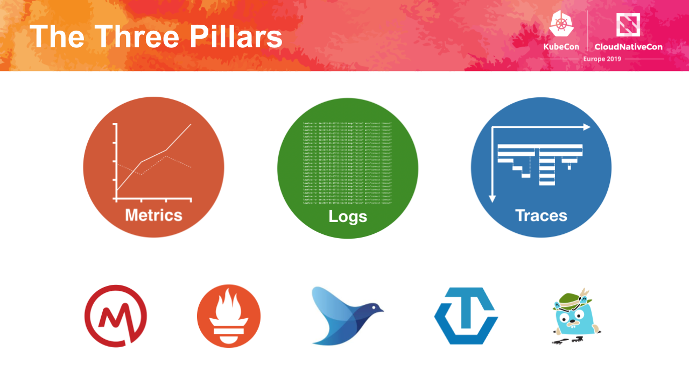

# Three Pillars of Observability

1. Metrics - Normally this is time series data that is used in trends for memory usage and latency.
“The CNCF has some great projects in this space,” said Wilkie. “OpenMetrics is an exposition format for exporting metrics from your application, and Prometheus is probably now the defacto monitoring system for Kubernetes and apps on Kubernetes.”

2. Logs - Logs, or events, are what comes out of your containers in Kubernetes. The CNCF has Fluentd and there’s log shipping on SQL.

3. Traces - “This is potentially the hardest one to sum up in a single sentence,” said Wilkie. “I think of distributed traces as a way of recording and visualizing a request as it traverses through the many services in your application.”

In this space, there is OpenTelemetry as well as Jaeger, a CNCF project which “we use ourselves” at Grafana Labs, said Wilkie.

# Observability Videos
[Keynote: ...What Does the Future Hold for Observability? - Tom Wilkie & Frederic Branczyk](https://youtu.be/MkSdvPdS1oA) 

# Observability Links
[What's Next for Observability](https://grafana.com/blog/2019/10/21/whats-next-for-observability/) 